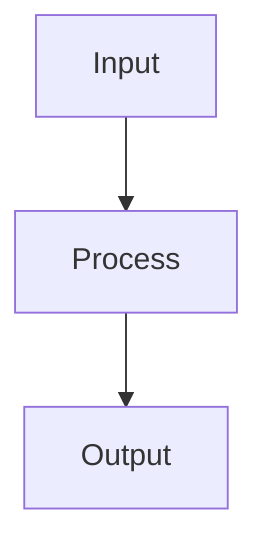

# project-name

[](https://github.com/greynewell/agentic-template/actions)
[](./LICENSE)

A starter template for AI-first development. Scaffolds `AGENTS.md`, `CLAUDE.md`, `CHANGELOG`, and `README` so coding agents like Claude Code, Cursor, and Copilot have the right context from day one.

## Architecture



Brief explanation of how the system works and what the key components are.

## Quick Start

```bash
git clone https://github.com/USERNAME/REPO.git
cd REPO
# install/build commands here
```

## Features

- **Feature one** — what it does
- **Feature two** — what it does
- **Feature three** — what it does

## Development

### Prerequisites

- Dependency 1
- Dependency 2

### Build

```bash
# build command here
```

### Run Tests

```bash
# test command here
```

### Project Structure

```
project-name/
├── src/              # Source code
├── tests/            # Test suite
├── docs/             # Documentation
└── ...
```

## Contributing

1. Fork the repository
2. Create a feature branch
3. Make your changes
4. Run tests to verify
5. Submit a pull request

## Roadmap

See the [project roadmap](https://github.com/USERNAME/REPO/projects) for planned milestones and progress.

## Documentation

- [Changelog](./CHANGELOG.md): version history and release notes

## License

[MIT](./LICENSE)

---

[project-url.com](https://project-url.com) | Built by [Your Name](https://your-site.com)
